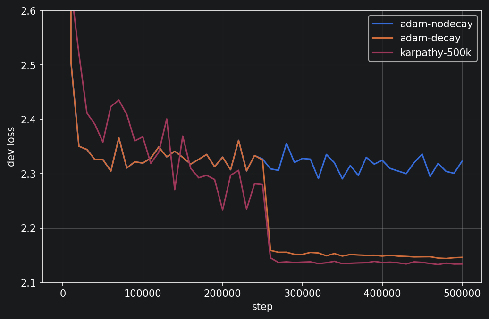
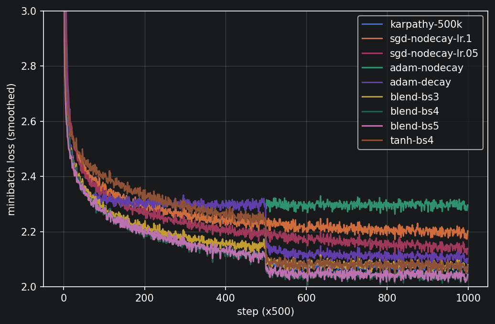

# makemore-from-scratch

Character-level language models built from scratch in PyTorch, following
[Karpathy's makemore series](https://karpathy.ai/zero-to-hero.html). This is the
second stage of a from-scratch ML self-study project, after
[micrograd-from-scratch](https://github.com/SuvirRathore/micrograd-from-scratch).
Parts 1 and 2 are here now, together with a hyperparameter study on the MLP;
Parts 3–5 (initialisation and normalisation diagnostics, manual backprop, a
WaveNet-style model) will be added as I work through them.

## Notebooks

`bigram.ipynb` — Part 1. A bigram model on ~32k names, built twice. First by
counting: a 27×27 count matrix, row-normalised into transition probabilities,
sampled with `torch.multinomial`, evaluated by average negative log-likelihood
(~2.45), with add-1 smoothing to remove the infinite surprise on unseen pairs.
Then as a neural net: one-hot inputs through a single 27×27 weight matrix and
softmax, trained by gradient descent on the same loss. Over a couple of hundred
steps its loss falls to the counting model's level, because the network can
only rediscover the count matrix: the counting model is already the exact
bigram MLE. That convergence is the point of building it both ways. Along the
way, L2 regularisation and count smoothing turn out to be the same knob seen
from two sides: both pull the model toward uniform.

`mlp.ipynb` — Part 2. The Bengio-style MLP: learned 10-dimensional character
embeddings, a three-character context window, a 200-unit tanh hidden layer,
cross-entropy on logits. Train/dev/test split by word rather than by example (a
row-level split leaks bigrams from the same name across sets), minibatch SGD, a
log-spaced learning-rate sweep, step decay. The second half is the study below,
run through a single `train_and_eval` harness: parameters rebuilt fresh per run
from a seeded generator, evaluation under `no_grad`, and each run's exact
configuration captured from `locals()` inside the function. Both design choices
exist because I got burned without them: state leaking between runs through a
global parameter list, and recorded configurations drifting from what actually
executed in a notebook.

## Beating Karpathy

Baseline: the video ends at a dev loss of 2.17. Reproducing its exact
configuration (10-dimensional embeddings, 200 hidden units, batch 32, block
size 3, SGD at 0.1 decayed ×0.1 halfway) gives 2.1698 at 200k steps, so the
baseline is pinned. From there I varied one thing at a time and measured what
each tweak is worth. Full numbers are in the table below; the seed paragraph is
the error bar for all of them.

Learning-rate schedule: worth the most. At a constant 0.1 the model stops
improving early and oscillates, with dev loss wandering in a band roughly 0.1
wide (wider than all the improvement that remains) before finishing at 2.2742.
The same run with the halfway decay drops ~0.14 in a single evaluation window
and finishes at 2.1337. Simply halving the constant rate, with no schedule at
all, recovers most of that (2.1776). Late-phase step size dominates this
benchmark; everything else is second-order next to it.

Iterations: the tweak that actually beats 2.17 like for like. The video's
configuration at 500k steps instead of 200k gives 2.1337, nothing else changed.
It's a compute result rather than an insight, and the schedule finding caps it:
after the decay fires, the entire second half of training is worth about 0.01,
so pushing past 500k buys almost nothing.

Optimiser: a lesson in experimental controls rather than a lever. My first
comparison had Adam plateauing ~0.18 above SGD, and I nearly reported that; the
comparison was broken, because the SGD runs had a decay schedule and the Adam
runs didn't. One control run closed the gap: 2.3230 without decay, 2.1459 with,
against SGD's 2.1337. The mechanism is that Adam removes SGD's built-in
annealing: SGD's step is lr·g and shrinks as gradients shrink, while Adam's
step is lr·m̂/√v̂ ≈ ±lr regardless, so without a schedule it orbits the minimum
at a radius set by lr. What Adam does buy is speed: it crosses loss 2.4 in
17.5k steps against SGD's 30.5k, at about 1.8× the cost per step. Speed, not a
lower floor.

Seeds: not a tweak, but the error bar on every claim above. The same tanh
configuration on seeds 0, 1 and 2 spans 2.1539–2.1677, a spread of 0.0138. Any
improvement smaller than that is noise, and this retired one of my own results:
a single-seed comparison had the learnable blend beating tanh by 0.009, but
across three paired seeds the differences flip sign (+0.003, −0.007, −0.009)
and the means favour tanh (2.1603 vs 2.1648). The original "win" was one
unlucky tanh seed. A lucky seed would also "beat 2.17" by pure selection, which
is why seed is the one knob I refuse to turn.

Learnable per-neuron activation: each hidden neuron trains a parameter α,
applied as sigmoid(α)·tanh + (1−sigmoid(α))·relu, carried over from my
micrograd experiments. At the video's block size it does not improve final
loss. What survives across every seed: it reaches loss 2.4 in roughly half the
steps, and its train/dev gap is consistently smaller (~0.024 vs ~0.039). Its
large advantage exists before the decay (~0.14) and collapses after (~0.01), so
the blend compensates for a too-high learning rate rather than adding capacity,
consistent with the schedule being the dominant factor. That verdict is
specific to block size 3, as the next result shows.

Block size: the biggest number, and the one genuine surprise. Extending the
context from 3 to 4 characters with the blend gives 2.0877, but the control run
with tanh at block size 4 gives 2.1356, no better than tanh at block size 3. At
these settings the wider context is only usable with the blend: the gain is a
joint effect, not attributable to the context window alone. A likely mechanism
is optimisation rather than capacity: block size 4 means a wider input layer
under the same unscaled initialisation, which is harder on a saturating
activation, and compensating for optimisation difficulty is exactly what the
blend was shown to do above. That is a single-seed comparison, though the 0.048
margin is three times the measured seed spread. Either way it isn't a
like-for-like win over 2.17: conditioning on more context changes the
attainable floor, so it's a different problem, not a better solution to the
same one.

Ranked: the learning-rate schedule matters most and costs nothing; iterations
reliably convert compute into loss until the decay caps them; block size buys
the most but changes the question, and at these settings only pays with the
blend; the optimiser changes speed, not the destination, once both are
scheduled; the activation blend changes the route (faster early, better
generalisation gap) but not the destination at block size 3; and seeds are the
measurement noise everything above has to clear.

## Where the blend parameters end up

At initialisation every sigmoid(α) lies in [0.27, 0.73]. After 500k steps of
training, 49% of neurons sit below 0.3 and 35% above 0.7, with the middle
emptied to under a quarter of its initial occupancy: given the freedom, neurons
commit to one activation rather than averaging. This replicates, at 200 neurons
on a language model, the bimodality I found on 8-neuron XOR nets in the
micrograd work. The lean toward ReLU from those experiments also appears (49%
in the ReLU-dominant tail against 35% in the tanh tail), though more moderately
than on XOR.

## Results

| run | opt | activation | lr | decay | steps | train | dev |
|---|---|---|---|---|---|---|---|
| karpathy-200k | sgd | tanh | 0.1 | ×0.1 @ 50% | 200k | 2.1268 | 2.1698 🟠 🟠 |
| karpathy-500k | sgd | tanh | 0.1 | ×0.1 @ 50% | 500k | 2.0703 | 2.1337 🟢 🟠 |
| sgd, no decay | sgd | tanh | 0.1 | none | 500k | 2.2026 | 2.2742 🔴 🔴 |
| sgd, no decay | sgd | tanh | 0.05 | none | 500k | 2.1269 | 2.1776 🟠 🔴 |
| adam, no decay | adam | tanh | 0.01 | none | 500k | 2.3066 | 2.3230 🔴 🔴 |
| adam, decay | adam | tanh | 0.01 | ×0.1 @ 50% | 500k | 2.1069 | 2.1459 🟢 🟠 |
| blend-bs3 | sgd | blend | 0.1 | ×0.1 @ 50% | 500k | 2.0748 | 2.1251 🟢 🟠 |
| blend-bs4 | sgd | blend | 0.1 | ×0.1 @ 50% | 500k | 2.0369 | 2.0877 🟢 🟢 |
| blend-bs5 | sgd | blend | 0.1 | ×0.1 @ 50% | 500k | 2.0393 | 2.0956 🟢 🟢 |
| tanh-bs4 | sgd | tanh | 0.1 | ×0.1 @ 50% | 500k | 2.0723 | 2.1356 🟢 🟠 |

Two markers per dev result, both using the measured seed spread (0.0138) as
the noise band. First: against the video's 2.17 (🟢 better by more than the
band, 🟠 within it, 🔴 worse by more). Second: the same comparison against the
reproduced baseline at the same iteration count (2.1698 at 200k, 2.1337 at
500k), which removes the extra-compute advantage.

Unless stated: embedding dim 10, 200 hidden units, batch 32, block size 3, seed
2147483647. All selection was on the dev set. Evaluated once on the held-out
test set at the end, the headline configuration gives 2.1320. The notebook's
`karpathy-500k-test` row reproduces `karpathy-500k` exactly (same seed, same
trajectory), and the three-seed comparison with paired differences is in the
notebook.

## Directions and future work

Part 3 of the series is the natural next test for most of what this study left
open. The initial dev loss of 25.1 (against a uniform baseline of 3.30) and the
blend-only gain at block size 4 both point at the same suspect: the unscaled
random initialisation. Three predictions I want to score against Part 3's
diagnostics rather than retrofit: scaling the output layer at initialisation
should bring the starting loss down to roughly 3.3 and remove the hockey-stick
phase; the fraction of saturated tanh units at initialisation should be visibly
higher at block size 4 than at 3, which would confirm the proposed mechanism
for the interaction; and the schedule's dominance should shrink somewhat under
proper initialisation, since part of what the high-rate phase was doing is
escaping a bad starting point.

The one experiment the study leaves genuinely open is whether the blend
survives good initialisation. Its established role here is compensating for
optimisation difficulty, so once initialisation (and later BatchNorm) removes
that difficulty, I expect its convergence-speed edge to shrink toward zero. The
open question is whether the smaller train/dev gap survives: that is the one
effect that does not look optimisation-flavoured. Two cheap companions: a
three-seed comparison at block size 4, since the 0.048 gap is currently
single-seed, and the alpha distribution at block size 4, where a stronger ReLU
lean would support the compensation story.

On schedules, the designed-but-unrun experiment is decay timing: firing the
decay at 25% of an 80k-step run should reach roughly the same loss at 40% of
the compute. A more quantitative version would measure the width of the
oscillation band as a function of learning rate and check that it scales with
step size times gradient noise, turning "late-phase step size dominates" from
an observation into a model.

Finally, for completeness: hidden width, embedding dimension and batch size
were never swept; block size 5 landing slightly worse than 4 is unexplained,
and concatenating ever wider contexts is exactly what the series' Part 5
hierarchy exists to fix; and I have not checked what a 0.05 loss difference
buys in sample quality. Names from the 2.17 and 2.09 models side by side, same
seed, would ground the metric in what the model actually produces.

## Running it
python -m venv .venv && source .venv/bin/activate
pip install -r requirements.txt
jupyter notebook
`bigram.ipynb` runs in under a minute. A full re-run of `mlp.ipynb` is ~15
minutes on an M-series CPU and regenerates every number and figure above from
fixed seeds.

Data is `names.txt` from the original makemore repository. MIT license.
