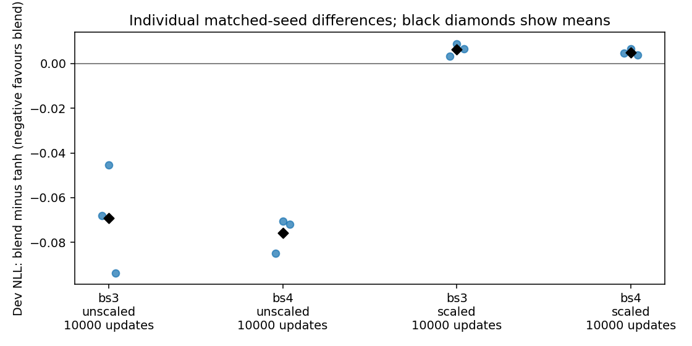
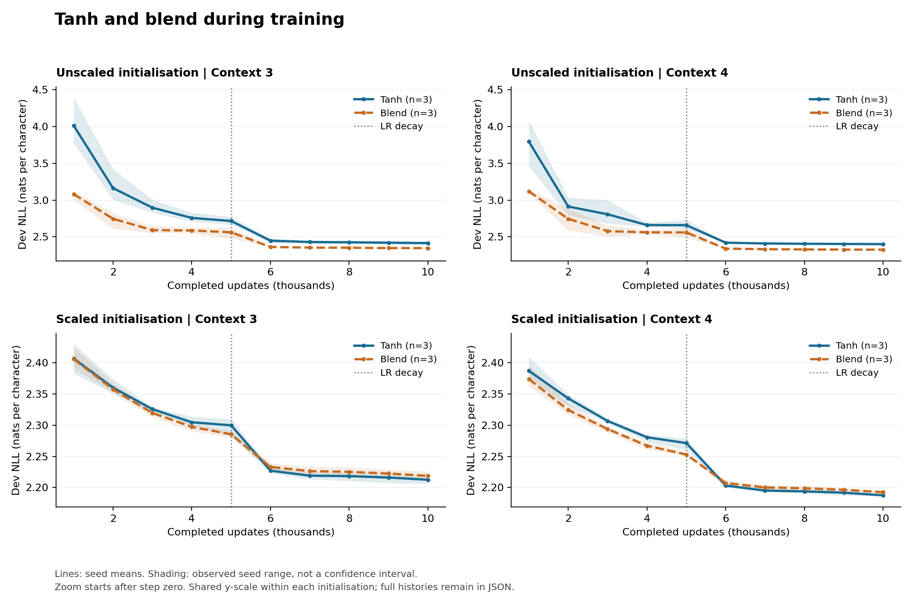

# makemore-from-scratch

**Character-level language models, explicit training code and experiments that test why a result improves.**

I implemented count-based and neural bigram models and a character MLP following [Karpathy’s makemore series](https://karpathy.ai/zero-to-hero.html), then experimented with learning-rate schedules, optimisers, context length and a learnable activation carried over from my micrograd project. Two apparent improvements changed how I approached the experiments: an Adam–SGD comparison turned out to mix different learning-rate schedules, and a small activation gain did not hold up in additional seed comparisons.

PyTorch supplies automatic differentiation. The models, parameter initialisation and SGD/Adam updates are written explicitly. Implementing autodiff itself was the focus of my earlier [micrograd project](https://github.com/SuvirRathore/micrograd-from-scratch).

## Overview

- **Three model implementations:** transition counts with smoothing, neural bigram logits, and an MLP with learned character embeddings.
- **Experimental controls:** splits grouped by name spelling; separate RNG streams for shared parameters, activation coefficients, minibatches and sampling; fresh model and optimiser state for each run.
- **Numerical checks:** handwritten SGD and bias-corrected Adam agree with PyTorch reference optimisers; tests also cover likelihood calculations, gradient checks, matched minibatches and checkpoint round-trips.
- **An executed initialisation pilot:** 24 runs covering two contexts, two activations, two initialisations and three matched seeds. At this short budget, the blend's advantage under unscaled initialisation reverses after scaling.
- **Inspectable evidence:** saved protocols, split membership, complete dev histories, diagnostics, per-seed differences, timings and model checkpoints. Test evaluation is a separate explicit action.

## Experiments That Changed My Mind

These observations come from the original experiments. Their scores use the earlier data split; the [original experiment notes](docs/legacy-study.md) retain the configurations and explain the limitations. The current split and follow-up results are described below.

### The Missing Control in My Adam Comparison

My first comparison made Adam look substantially worse than SGD, and I nearly reported that conclusion. I then noticed that the SGD runs had learning-rate decay while the Adam runs did not.

Adding the missing control changed Adam’s dev NLL from 2.3230 to 2.1459, against SGD’s 2.1337. Most of the apparent gap disappeared. These runs did not establish which optimiser was best; they showed that my original comparison could not separate optimiser choice from the schedule.

### An Activation Improvement That Did Not Hold Up

I brought the learnable tanh/ReLU blend over from my micrograd experiments. At context length three, my first 500k-step comparison looked encouraging: dev NLL was 2.1251 for the blend against 2.1337 for tanh.

I then checked three additional seeds. The direction of the difference varied, and the average dev loss favoured tanh: 2.1603 against 2.1648 for the blend. I stopped treating the first result as evidence of a consistent improvement.

Those additional runs used 200k steps, so they did not directly replicate the original 500k-step comparison. My original use of the three-seed range as a universal “noise band” was also too strong. The current reports show individual differences and their standard error instead.

The blend also had a smaller train/dev gap in those additional runs. Since its average dev loss was higher, that smaller gap was not evidence of better predictive performance.

## What I Implemented

The experiment harness grew out of two notebook mistakes. A global parameter list allowed state to leak between runs, and my recorded configurations sometimes drifted from what the notebook had actually executed. I changed the original training function to rebuild parameters for every run and record the configuration used inside the function. The current shared module extends that approach with separate random-number streams and saved run records.


| File | Role |
| --- | --- |
| [bigram.ipynb](bigram.ipynb) | Builds transition counts, explains the MLE and smoothing, trains neural logits, separates NLL from regularisation, and generates samples. |
| [mlp.ipynb](mlp.ipynb) | Explains the MLP forward pass and optimiser, inspects initialisation, loads or reruns the pilot, and examines paired outcomes and samples. |
| [makemore.py](makemore.py) | Training and checkpoint code for the command-line runner; tests check agreement with the explicit notebook implementations. |
| [experiments.py](experiments.py) | Freezes study configurations before execution, runs comparisons, saves reports and plots, and performs explicitly requested final test evaluation. |
| [tests/test_makemore.py](tests/test_makemore.py) | Numerical and protocol checks covering the errors that would invalidate these comparisons. |

The default MLP uses 10-dimensional character embeddings and a 200-unit hidden layer. Three-character tanh has 11,897 parameters; the blend adds 200. Four-character tanh has 13,897 parameters. Each blended neuron learns $f(z)=\alpha\tanh(z)+(1-\alpha)\max(0,z)$ with $\alpha=1/(1+e^{-a})$, training $a$ alongside the weights.

The bigram notebook distinguishes three objects: unsmoothed count probabilities are the MLE; additive smoothing changes that estimator; L2 regularisation changes the neural optimisation objective. Count smoothing and penalising logits are not mathematically equivalent. Neural data NLL and its regularisation penalty are reported separately.

## Data and Evaluation

The dataset has 32,033 records and 29,494 distinct name spellings. Every copy of a spelling is assigned to one split before character examples are constructed. Duplicate records retain their frequency weighting within that split.

| Split | Distinct spellings | Records | Next-character targets |
| --- | ---: | ---: | ---: |
| Train | 23,595 | 25,640 | 182,666 |
| Dev | 2,949 | 3,196 | 22,801 |
| Test | 2,950 | 3,197 | 22,679 |

The split is fixed by seed 42 and saved with source and membership hashes. There is no spelling overlap between partitions. Loss is mean next-character NLL in natural-log units, including the end-of-name token. Lower is better.

Every run records an actual pre-training evaluation at step zero and full-dev evaluations at fixed intervals after updates. Minibatch training losses are separately labelled. Time-to-target uses the first **observed dev-loss** crossing, with evaluation overhead included; it is not an interpolated crossing or a claim of sustained performance.

The current real-data runs do not evaluate the test partition. The historical corpus has already been used in earlier experiments, so this should not be presented as an entirely new, historically unseen dataset.

## Current Findings: an Initialisation Pilot

The initialisation question came from a result I could not explain. In the original single-seed experiments, extending the context from three to four characters improved the blend substantially, while tanh barely changed. At context four, the blend reached dev NLL 2.0877 against tanh’s 2.1356.

That made me wonder whether the wider input was exposing a problem with the unscaled initialisation. If more tanh units started saturated, perhaps the blend was helping the model train under those conditions. This was a proposed explanation, not an established mechanism. It led to a concrete question: would the blend’s advantage shrink after changing the initialisation?

The pilot below examines that question during early training.

The included pilot fixes batch size 32, SGD learning rate 0.1, tenfold decay after 5,000 updates, evaluation every 1,000 updates, and a **10,000-update** budget. Each setting uses seeds 0, 1 and 2, matched for shared weights and minibatches. These are early-training results, not completed 200k/500k-step replications.

| Initialisation | Context | Mean tanh dev NLL | Mean blend dev NLL | Mean blend − tanh | SE of paired difference |
| --- | ---: | ---: | ---: | ---: | ---: |
| Unscaled | 3 | 2.4159 | 2.3469 | −0.0690 | 0.0139 |
| Unscaled | 4 | 2.4015 | 2.3257 | −0.0758 | 0.0046 |
| Scaled | 3 | 2.2124 | 2.2186 | +0.0062 | 0.0016 |
| Scaled | 4 | 2.1875 | 2.1924 | +0.0049 | 0.0008 |



**Observation:** the blend has lower mean dev loss with unscaled initialisation, while tanh has lower mean dev loss with the scaled reference initialisation. Scaled tanh also benefits from the wider context in these runs. The evidence therefore does not support a general claim that only the blend can exploit four-character context.

The fraction of initially saturated tanh activation values falls from approximately 64%/69% at context three/four to approximately 12% in both scaled settings. Scaled initial dev losses are close to the uniform baseline $\log(27)\approx3.296$.

**Interpretation:** initialisation materially affects the early activation comparison. The intervention changes hidden scaling, biases and output scaling together, so it does not identify saturation as the sole cause. Longer budgets and more targeted controls remain necessary to assess final-loss behaviour.

There are only three seeds per setting. The reported standard error describes seed variation conditional on this split and protocol; it is not a universal noise band, a correction for model selection, or proof of a general activation ranking. A smaller train/dev gap alone is not a generalisation improvement.

Full values, configurations and observations are in the [pilot report](results/initialization-pilot/README.md), [protocol](results/initialization-pilot/protocol.json) and [machine-readable summary](results/initialization-pilot/summary.json).

<details>
<summary>Training curves: tanh versus blend</summary>



Each panel compares two activations. Lines show the mean across three seeds; shading shows their observed range, not a confidence interval. The dotted line marks learning-rate decay. The plot starts at the first post-update evaluation (1,000 updates), so the large initial losses do not flatten the training curves. The two initialisations use different vertical scales, shared across context lengths.

[Per-seed timing curves](results/initialization-pilot/dev_by_time.png) are available separately. They use the recorded timestamps, including dev evaluation; elapsed time is specific to this CPU environment.

</details>

## Changes from the Original Study

The original study showed why controls matter. The code and documentation now also correct the issues found during review:

- Duplicate spellings are grouped before splitting.
- Optional activation parameters cannot change the minibatch RNG sequence.
- Absolute decay steps and actual completed-update counts are recorded.
- Per-seed differences replace significance labels based on a three-seed range.
- The notebooks write out the model and training loop directly; the command-line runner also saves results outside notebook memory.
- Historical test NLL 2.1320 is correctly attributed to the three-character tanh baseline, not the four-character blend with dev NLL 2.0877.

The [historical report](docs/legacy-study.md) retains the original figures and scores. They are not directly comparable to current-protocol losses.

## Setup and Checks

Use Python 3.11 or later; the recorded validation environment uses Python 3.12 and CPU PyTorch 2.8.0. From the repository root:

```bash
python -m venv .venv
source .venv/bin/activate
pip install -r requirements.txt
python -m unittest discover -s tests -v
jupyter notebook
```

Open either notebook. `bigram.ipynb` trains its small count/neural examples. `mlp.ipynb` loads the included pilot by default; set `RUN_TRAINING=True` to create a fresh pilot in `results/local/`. Neither notebook's Run All evaluates the test partition.

Execute both notebooks in fresh kernels with `python scripts/check_notebooks.py`. In environments that cannot start kernel sockets, `python scripts/check_notebooks.py --in-process` executes each in a fresh local IPython process. The automated workflow runs the numerical tests and notebook execution.

The [validation record](docs/validation.md) states exactly what was executed and which longer studies remain unrun.

## Running the Study

Every command writes a protocol and split manifest before training. Choose a new output directory: existing directories are deliberately not overwritten. Results include final checkpoints, JSON histories, paired summaries and plots.

Reproduce the included 24-run pilot:

```bash
python experiments.py run --suite initialization --steps 10000 --seeds 0 1 2 --eval-every 1000 --output results/local/initialization-pilot
```

Run a fixed-budget, ten-seed activation comparison (20 runs, 4 million updates):

```bash
python experiments.py run --suite paired --steps 200000 --seeds 0 1 2 3 4 5 6 7 8 9 --initialization scaled --output results/local/paired-200k
```

Run the ten configuration controls with a 500k main budget (the shorter baseline uses 200k):

```bash
python experiments.py run --suite main --steps 500000 --seeds 0 --initialization unscaled --output results/local/main-500k
```

The decay-timing experiment comes from the shape of the original learning curves: much of the improvement happened shortly after the learning rate dropped. That raised a practical question: could an earlier drop reach a comparable dev loss with fewer updates and less elapsed time?

The following study compares decay after 25%, 50% and 75% of an 80k-update budget, together with a no-decay control, across ten seeds. It records when each run first reaches specified dev-loss targets. This experiment is implemented but has not yet been run.

```bash
python experiments.py run --suite decay --steps 80000 --seeds 0 1 2 3 4 5 6 7 8 9 --eval-every 1000 --output results/local/decay-80k
```

`--suite initialization` also supports longer budgets and additional seeds; eight runs are scheduled per seed. These longer studies are implemented but have not been run in the included results. BatchNorm, manual backpropagation and a WaveNet-style model remain future work.

Regenerate reports from saved JSON with `python experiments.py summarize STUDY_DIRECTORY`. Generate names using `python experiments.py sample PATH_TO_MODEL_PT`. Only after dev-based selection is complete, run `python experiments.py test --checkpoint PATH_TO_SELECTED_MODEL_PT --output PATH_TO_TEST_REPORT_JSON`. The test command verifies split identity and refuses to overwrite a report; avoiding repeated test-guided selection still requires discipline.

The [full protocol](docs/experiment-protocol.md) documents the initialisation intervention, timing boundaries, statistical interpretation and checkpoint limitations.

Data: [names.txt](names.txt), attributed to the original [makemore repository](https://github.com/karpathy/makemore). Code: [MIT licence](LICENSE).
