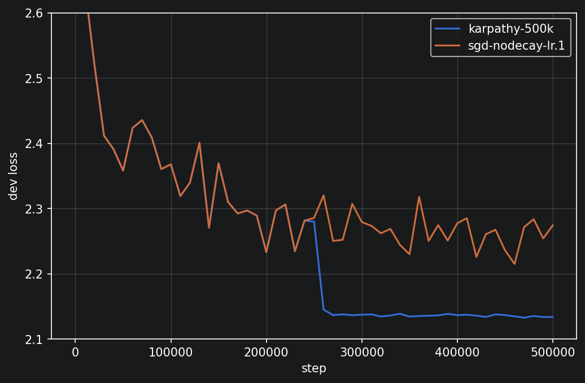
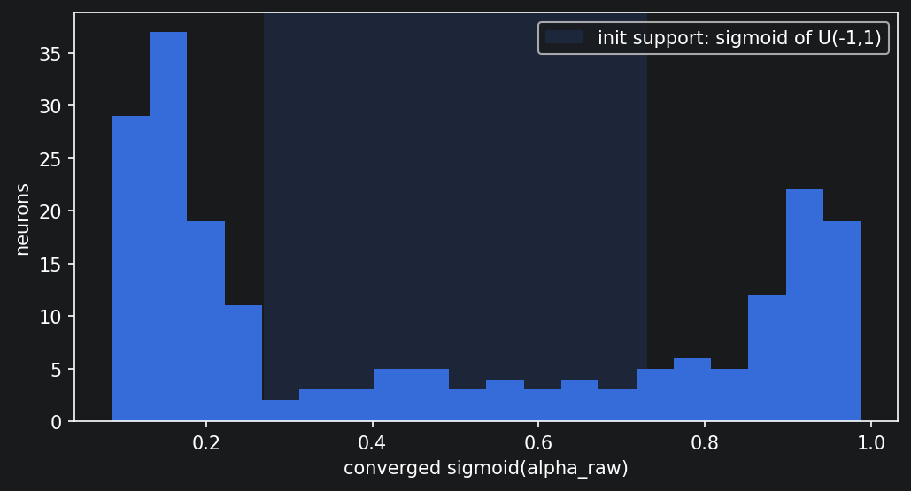

# Historical study: original record split

These results were saved in the original notebook. They are retained for provenance and are not rerun results under the corrected protocol. Machine-readable values are in [recorded-results.json](../results/legacy/recorded-results.json).

## What the Experiments Showed

The study reproduced a video-style 200k-step MLP baseline at dev NLL 2.1698. With 500k steps and proportionally later decay, it reached 2.1337. A learning-rate control reduced Adam's recorded gap to scheduled SGD: Adam without decay gave 2.3230; with decay, 2.1459. These are configuration-specific observations, not an exhaustive optimiser ranking.

At context three and the default seed, the blend reached 2.1251 against tanh's 2.1337 at 500k steps. Three further seed comparisons at 200k steps gave mean dev NLL 2.1648 for blend and 2.1603 for tanh. The additional runs challenged the claim of a consistent benefit but did not replicate the original training budget.

At 500k steps, context four with the blend gave 2.0877, while context-four tanh gave 2.1356. This single-seed observation motivated the initialisation/saturation follow-up.

| Run | Context | Optimiser | Activation | Initial LR | Decay | Steps | Train NLL | Dev NLL |
| --- | ---: | --- | --- | ---: | --- | ---: | ---: | ---: |
| karpathy-200k | 3 | SGD | tanh | 0.1 | ×0.1 after 100k | 200k | 2.1268 | 2.1698 |
| karpathy-500k | 3 | SGD | tanh | 0.1 | ×0.1 after 250k | 500k | 2.0703 | 2.1337 |
| sgd-nodecay-lr.1 | 3 | SGD | tanh | 0.1 | None | 500k | 2.2026 | 2.2742 |
| sgd-nodecay-lr.05 | 3 | SGD | tanh | 0.05 | None | 500k | 2.1269 | 2.1776 |
| adam-nodecay | 3 | Adam | tanh | 0.01 | None | 500k | 2.3066 | 2.3230 |
| adam-decay | 3 | Adam | tanh | 0.01 | ×0.1 after 250k | 500k | 2.1069 | 2.1459 |
| blend-bs3 | 3 | SGD | blend | 0.1 | ×0.1 after 250k | 500k | 2.0748 | 2.1251 |
| blend-bs4 | 4 | SGD | blend | 0.1 | ×0.1 after 250k | 500k | 2.0369 | 2.0877 |
| blend-bs5 | 5 | SGD | blend | 0.1 | ×0.1 after 250k | 500k | 2.0393 | 2.0956 |
| tanh-bs4 | 4 | SGD | tanh | 0.1 | ×0.1 after 250k | 500k | 2.0723 | 2.1356 |

The default seed was 2147483647, embedding dimension 10, hidden width 200 and batch size 32. Initialisation was unscaled. These numbers were printed to four decimal places in the original notebook.

## Qualifications and Corrections

- The old split shuffled 32,033 records before splitting. There were 29,494 distinct spellings; 424 dev records and 377 test records had spellings also found in training. The corrected code groups all copies of a spelling before splitting.
- The old seed pairs shared initial weights, but the optional blend parameters advanced the same generator subsequently used for minibatches. The corrected code separates those streams.
- The three-seed range 0.0138 was descriptive, not a valid universal error bar. The earlier significance colours have been removed.
- The blend's smaller train/dev gap did not establish better prediction; its average dev loss across the three additional seeds was higher.
- The old `steps_to` statistic measured a 500-update minibatch-training-loss window, not a dev-loss threshold or a wall-clock advantage.
- Longer training also moved the absolute decay step. It was not the shorter run continued under an unchanged schedule.
- The historical test NLL **2.1320 belongs to `karpathy-500k-test`, the context-three tanh baseline**. There is no recorded test result for the best-dev context-four blend.
- Unscaled initialisation and saturation were proposed mechanisms, not established causes. Adam's moment normalisation does not imply a universally constant step or a proven orbit around a minimum.

## Original Plots

Training curves and activation coefficients

The histogram records one trained model. Different activation coefficients do not alone establish functional specialisation or generalisation benefits.

